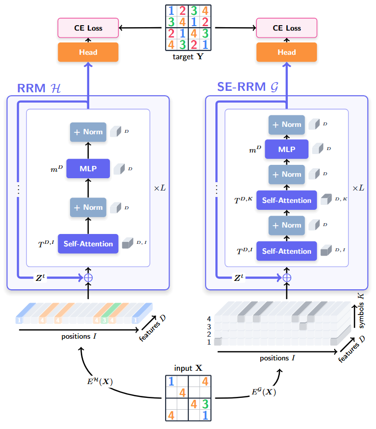

# SE-RRM

## Symbol-Equivariant Recurrent Reasoning Models

[](https://arxiv.org/abs/2603.02193)

We introduce **Symbol-Equivariant Recurrent Reasoning Models** (SE-RRMs), which enforce permutation equivariance at the architectural level through symbol-equivariant layers, guaranteeing identical solutions under symbol or color permutations. SE-RRMs outperform prior RRMs on 9×9 Sudoku and generalize from just training on 9×9 to smaller 4×4 **and** larger 16×16 and 25×25 instances, to which existing RRMs cannot extrapolate. On ARC-AGI-1 and ARC-AGI-2, SE-RRMs achieve competitive performance with substantially less data augmentation and only 2 million parameters, demonstrating that explicitly encoding symmetry improves the robustness and scalability of neural reasoning.



### Requirements

- Python 3.10 (or similar)
- Cuda 12.6.0 (or similar)

```bash
pip install --upgrade pip wheel setuptools
pip install --pre --upgrade torch torchvision torchaudio --index-url https://download.pytorch.org/whl/nightly/cu126 # install torch based on your cuda version
pip install -r requirements.txt # install requirements
pip install --no-cache-dir --no-build-isolation adam-atan2 
wandb login YOUR-LOGIN # login if you want the logger to sync results to your Weights & Biases (https://wandb.ai/)
```

### Dataset Preparation

```bash
# Sudoku-Extreme
python dataset/build_sudoku_dataset.py --output-dir data/sudoku-extreme-1k-aug-1000  --subsample-size 1000 --num-aug 1000  # 1000 examples, 1000 augmentations


# ARC-AGI-1
python -m dataset.build_arc_dataset_dihedral \
  --input-file-prefix kaggle/combined/arc-agi \
  --output-dir data/arc1concept_d \
  --subsets training evaluation concept \
  --test-set-name evaluation

# ARC-AGI-2
python -m dataset.build_arc_dataset_dihedral \
  --input-file-prefix kaggle/combined/arc-agi \
  --output-dir data/arc2concept_d \
  --subsets training2 evaluation2 concept \
  --test-set-name evaluation2

# Maze-Hard
python dataset/build_maze_dataset.py # 1000 examples
```

## Experiments

### Sudoku-Extreme (assuming 1 A100):

```bash
python pretrain.py arch=trm_equi data_paths=[data/sudoku-extreme-1k-aug-1000] evaluators=[] epochs=10000 eval_interval=5000 \
arch.L_cycles=6 ema=True weight_decay=1 arch.dropout=0.2 arch.puzzle_emb_ndim=0 arch.add_tokens=4 global_batch_size=272 arch.halt_exploration_prob=0.05
```


### ARC-AGI-1 (assuming 4 H100):

```bash
torchrun --nproc-per-node 4 --rdzv_backend=c10d --rdzv_endpoint=localhost:0 --nnodes=1 \
pretrain.py arch=trm_equi data_paths="[data/arc1concept_d]" arch.L_layers=2 ema=True global_batch_size=272 \
eval_interval=800 arch.pos_encodings=rope2d arch.puzzle_emb_ndim=1 lr=0.0005 puzzle_emb_weight_decay=0.3 lr_min_ratio=0.1

```

### ARC-AGI-2 (assuming 4 H100):

```bash
torchrun --nproc-per-node 4 --rdzv_backend=c10d --rdzv_endpoint=localhost:0 --nnodes=1 \
pretrain.py arch=trm_equi data_paths="[data/arc2concept_d]" ema=True global_batch_size=272 \
eval_interval=800 arch.pos_encodings=rope2d arch.puzzle_emb_ndim=1 lr=0.0005 puzzle_emb_weight_decay=0.3 lr_min_ratio=0.1

```

### Maze-Hard (assuming 1 A100):

```bash
python pretrain.py arch=trm_equi data_paths="[data/maze-30x30-hard-1k]" evaluators="[]" epochs=10000 eval_interval=2000 \
ema=True arch.equivariant_symbols=False lr=0.0005 weight_decay=1 global_batch_size=64

```

## Reference

This code is based on the Tiny Reasoning Models [code](https://github.com/SamsungSAILMontreal/TinyRecursiveModels/tree/main), Hierarchical Reasoning Model [code](https://github.com/sapientinc/HRM) and the Hierarchical Reasoning Model Analysis [code](https://github.com/arcprize/hierarchical-reasoning-model-analysis).
